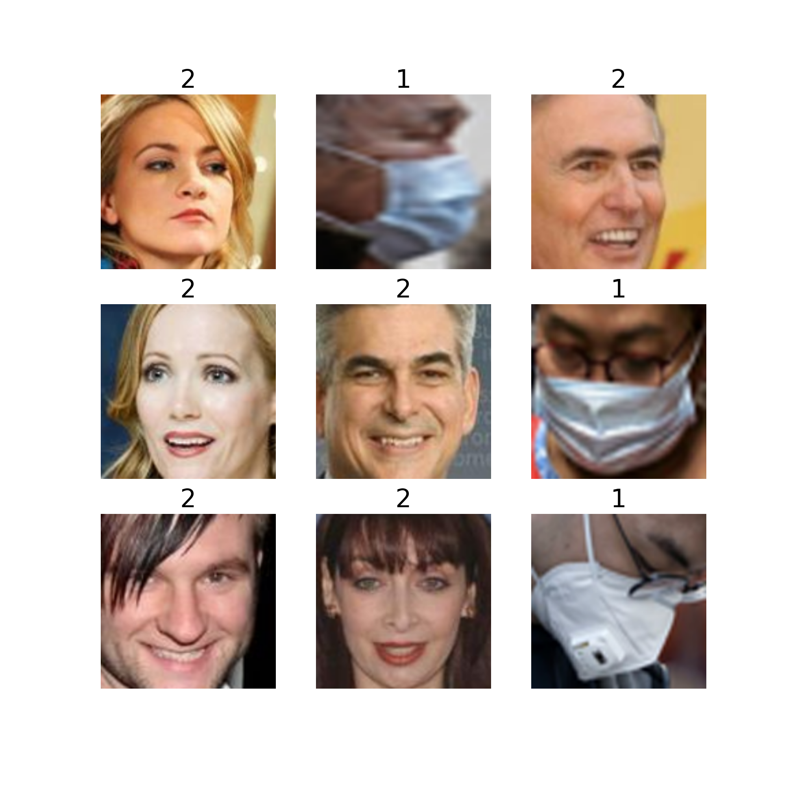
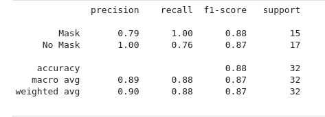
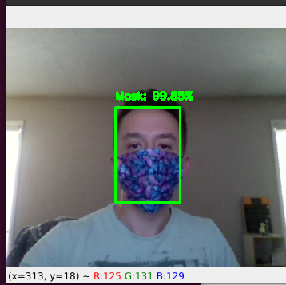
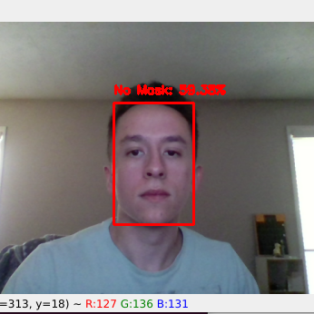

# **Mask Detection Using Keras/Tensorflow and Computer Vision**
## **Gary Monk**

[realatlas2022@gmail.com]() <br>
[GitHub](https://github.com/ATLas278)
<br>
[LinkedIn](https://www.linkedin.com/in/gary-monk-a58599164/)

# **Technology Used**
* *Keras/Tensorflow*
* *Sklearn*
* *imutils*
* *Computer Vision*
* *Numpy*
* *Pandas*
* *Seaborn*
* *Matplotlib*

# **Motivations**
The vaccines are rolling out, making the world a little bit safer than it was yesterday. A problem is that not everyone has gotten their vaccine, whether they have access to it or not. With hope of the world coming back to normal, it is time to be mor eproactive than ever before. <br>

Since social distancing and wearing a mask are the only monitored ways to avoid the infection until vaccinations become accessible for all, protocol detection is a big factor for us to gain insight in people's response to Covid-19.<br>

#### **Disclaimer and Practical Applications**
> This model is absolutley not intended as an authoritarian approach to solving the pandemic, but provides more perspective on people's individual protocal during the pandemic through precise statistics pulled from real-time monitoring. Look at it as pulling sentiment analysis data from first-hand human interaction, instead of through a survey, social media platform, or engagement/rating system.<br>
> There should be no legal consequences for the decisions one makes during the pandemic (unless the decision results in violence).

# **Dataset**
This is a balanced dataset of 5988 images belonging to two classes, "with_mask" and "without_mask"


# **Phase 1**
The first phase includes:<br>
1. Loading the face mask dataset
2. Training the face mask classifier with Keras/Tensorflow
3. Serializing the face mask classifier to disk
## Preprocessing
To preprocess my images, I performed **data augmentation** over my images using tensorflow's **ImagesDataGenerator** pipeline. This adds robustness and increases size of the dataset by manipulating multiple copies of a single image. It implements techniques such as rotating, horizontal flipping, zooming, and cropping. **ImageDataGenerator** generates batches of tensor image data with real-time augmentation.
```python
datagen = ImageDataGenerator(
        rotation_range=20,
        zoom_range=0.15,
        width_shift_range=0.2,
        height_shift_range=0.2,
        shear_range=0.15,
        horizontal_flip=True,
        fill_mode="nearest",
        validation_split=0.2)
```
<img src="data:image/jpeg;base64,/9j/4AAQSkZJRgABAQAAAQABAAD/2wCEAAoGCBUTExcVFRUYGBcZGx0bGhoZGhgjHRwfIBwZGRoaGRwcICsjGhwoIRkXJDUkKCwuMjIyHCE3PDcxOysxMi4BCwsLDw4PHRERHTEoIygxMTExMTExMTExMTExMTExMTExMTExMTExMTExMTExMTExMTExMTExMTExMTExMTExMf/AABEIALQBFwMBIgACEQEDEQH/xAAcAAABBQEBAQAAAAAAAAAAAAAGAAMEBQcIAgH/xABNEAABAwIEAwUEBQcICQQDAAABAgMRACEEBRIxBkFRBxMiYXEygZGhQrGzwdEUI1Jic7LSCBU0cpKT4fAXJCVTVGOio/EWQ4KDRGR0/8QAGAEBAQEBAQAAAAAAAAAAAAAAAAECAwT/xAAhEQACAgMBAAMAAwAAAAAAAAAAAQIRAxIhMRNBUSIycf/aAAwDAQACEQMRAD8A2J1wJBJIAG5JgfGvdNvtJWkpUJB3F/XlXP8A2oOKGaYpKbDU3sTaWWiY95J99RugdCUqxfJFBDCSYJ5kgV8z9BxCAEGI6f4VhTOnxurNaxuIdSqEN6xG8x15/KPOo6cydKSoYZRA1CAoTIJFpAnbf4SL1kmT5dojUq/x+uo2dcQJ1lLWmE21QPEfK22+1VTTI4NcNpVingU/mdQIGohQGkxeAZn49K8YLMXFuBKmFJEDUoqskkExtc2G3UTBtWDuZw7p0E+KAbACPLbzvVzwZxIC/wB26ElJBKSQCQRyk7g33vV2RmjdKVZtnGYMKaV4Ui28Csmzhfj8ClfE1NiPh1FX2ud+FcU2rEYMCdffsg3P+8RXRFaTsDaXASQCJESJuJ2kcude6E+1NpIyzGLAhRQJN+SkwR0PmKwvK1rW4hMkCepqSlRUrOkcwfcSR3aNfW8cxN9haet4tEmmU5g8f/xiOsrHVQja5sPK++0503iEt6QQNuYF6ps/wS33AsKhPQW+qsLJZt4mjXk4906x3JCkaeZIOrVMGBtpH9oEgU6jFu6kgs2KZJCtjpmIIjeU71kuDQ3h0FbivCkXm/uHnVJis/W4r80EpBNgALAczafjWlNNWZcadG3oxmI0kliFeCE6huQdVxvBj48oJry3mbpJH5OqQEk+P9IxHswSN4HL3ThT2fOGFTYTJFp+AFF/BGftuskuhGtKtJ8IuIEEj47VdkSjTsJi3FqAUyUDnJmPb6Wnwp2n2vK9hWQ8a4xlTcAAHysflWaLfhydSimbiTU2IdVU26sJBJIAG5JgD1NAnYw6hTL5Rt3ifjoH+FHL7SVpKVCQfX13FxWwO0ia547c3FJzVQSSkd03ZJI5HpUDIHylmSok+Zn66xKWpqMdnR0tTGKUQklIk2t7wCY5wJMc4iudc5fU+2EoURHQx9VQctwix7Tiv7R++nyI18bR0Uca/IjD26lcdeWkkXj58rlHHvcsOd+avNQ6RsAff6TzrnGeQrQ2fZ3V1PQeVVqs3djSVmYt5c61ZijqTAYpayoKbKCmOcgkzIBgeR9FDYyBNrmPhXiJSXkodOpsyJVcpMSIJ5EiIPWi/Ns5YW0RABjeKjlQo26lXIeNxKtR0uLj+sr8am5BipeYGpervm/pK21p86tkOr6VKlVBCx2CDpSVFQ0mRpIvsYMjyFYP2mqjN8UOq2vmy11rdHsI4pzUHSEyDog8tMidXOJ2+sg4l2j5ctzNsSRfxt3P7Bnp8KzLwqH2FpS2W9X0ag5fmRbXoF07b1Hx2CcC4JgERT2TZKpa9KTPM1NU1dBy7R9zvGr8SkmAEn47CneD8pQAFrGpXnyq3zPhpXdaeZ8M+tqpsQjF4dWlIUkdSQE/Aj6q5ZE/Dvia9YWYvK2nEjU2CQI2oQz/ACltn841KVIOrysatHsfifydKwIUSRflHP0qtbbffSQ5NxvKSBPKw5Vxbdpo7yUWqoOMay2luDG1Zbn7KQSU9T9dGvF2MEBIJkAbUH5stSwAUkedelo8Ll0a4LA/LsL+3Z+0TXTtcycKwMfhAP8AiGftEV0riUFSSEq0kiyuh6xImtQICfaPgEoyvGQVHUkG528YMCALXNjWMcPpC3LmNN62njzCLTlmKCnC4SlMSI+mm253t8OsmseyrKnEpWsDlSXpuJbZtiEqQkhW3Ka+5fmpUggzaqX8gUoSpW1E2R8OLUAo7GrqvUjOzBjMVOPKS0VHxEqPoLD6zRlw/lbTaRCZNpJ3NVmZZE4laloBJTIgb8j+PwprJ8Xi+9SlXskxBIJHmYA+fSvNO76erFVf6XOa5IwoH82BPS31VVcJZelGNUgewWyog9QpIH103mePxRdKU2SCdikEx0md6seHW1NLcdcMeDTBiZJ1fcKkG3JFyVr4SOMENluLTWaZggBZA2opzHGFTiiAT/n5UOYwSpSlWru108alZrf8n1IGGxEf74fZorQcwwKXQAoqEGfCR0jmDas8/k9n/VsT+2H2aKPsZhHFL1JeKBAGkAm95PteY5cq6LwGC9u1s0X5tN8z0PWqPBrCUaZ3FEHbkwpWariT+ba+o0IYrCrSQDa1TlmvEO4XGltUC4r3mOKUTIMACTTWX5apawhO5q/xfDS0tyff796ONeETsp+HMAlR1LE0Uv5a0tIlAttQu+xiMOdICkjr9H5ipwxz/ca+erT8pn0rzzTu7PbjcdaohZzlqGwVIlJF/hRgplsMIKo8SQfiJ++gyHnQQqTPORAmwFhvtVzxLigG0NySUoAJHOABetwT8bs45Wl1KgXzNCQpWnaa+8O/0pj9q1++mvOKWSBb317yD+lMftm/3011R5zrqlSpVoFe+H+88JRokWO8eGeXkr47jkDcQso/LH1GNRUnl/y24+UUc4nEvBcJa1Jt4tQHr/n16Xz3irEAY58EwdSfs24oLIOeMpKArpT3CLACisbGmlMpfGjVarDLsKGQEpNhQn3ZbYtwEpSbCRJpjDLkEJMgef1jlUXHuwkqkWHM/KhTKM7Qglp4pWpFgsmJ/qq6jaDvyNNknTNUH4A0jwJn0H4Uy4IBJgQknYdLVRpzloC7h0jb858iSfxp3DqRiGtaSNKpAifMGSbk1ltWa7Rned5wpTltqZdxLq0zptRX/M7TCjrEgnc7VDz3DJMd2sJT0rEpSUaRzlHtooeEkH8uwhP/ABDP2iK6XxGrSdMaotO0+flXO3DmE/13CqChZ9kx/wDYmuh8UtSUKKU6lAWHU9K1C66aKLiRtw4R0OqQR+b2B/TTqnaJt1i+9CDLaIgbUXcTYhw4N4uNhEaI8QM+NM7e74+VAjT6SImtksrThkqdKBEzRzgyG2wOgofwmVISrvJ8Rq0K7RNCJHpa0yDPiJPOBygVLZJkahI84/CgfPc2LOISoqBbjQUi/mVEcwNo33qywecMkSlQT1CV+E+gn8KKSNUwmUkckJA6wn8KEO0HMu5CECCSmfeSfwqxwuZtPOd2hUkDUSTqMTEDcD51Az3JULUHDJjlWLtcNMBMLmDiphMk1Hx2tR8QijZ5pnQe7hCutqGcVhdxrB86xKU26+jmo0zSf5PojDYr9sPs0VoGNS/q/NlATA36yZ5bbfE9LgfYI3pYxSZmHk/Zoo6x2IeSqG2taYknUBe9he9r/Ac7dV4UyvtKZScxcUqJ0tx6aR/jQvnTCS3q6UQdqr+nMnAbeBv92h3Ql7wat6os98HsDvdY2otzF4EBB2JEnym9UOWYIMCEmpOMdgFWoCBzNULhKw7klSWySATzv7wdvhU5uCi7aSZ5pT8dqzvL83CFFDoSuDIJ5TeEq5ETEbGOVXbWcNAe2sJ3A7wz5iSqwo2miq0wlSjxCQlI3sBy9BWT5rmClrNHOFWjEIUtJAElIgkkR1Ubk0PvZS2yolYlJ+FYsr6D5dWobWp3h8f60x+2b/fTVjmzSIHdqAHSomSt/wCssGf/AHWv300Um30wlR1pSpUq0UVC+J4Uw2IeddcbcC1LF9agCEoQgEAWAhI/zYFFKgB7D8IYVHspWP8A5q++oeNyJvvNHdOqSCPEHFAQQLm3Inr05aiktpUAN/8Ao3CSDpXI2lavxqozPs+wOnUGFrUTFnXbTMqtO3p87UX4jMG0K0LUAqAY8jqv6eE14/nVmJ12gGYVEHY7c/vHUVGk+sqdcQKYHs6wCkhRw7iD+iXXJHz/AMOki9WmC4KwbI/NpcSN4Di/qmrUZq1bxb6iLK2SFFRuLjwKv6da94XMm3CAlVzsPdP1SfcelTVe0LYP4TIGniUuMuJTcjUo/qiPZG9z/kx4d7N8vUZLbk/tXfuVRjSq0iAN/wCkMKw8hTeFcV3ZStK+8VBUDIHM2ISb/VRzSpVQVufYZLzRbUlSkrUkKCSQY1AkyNtv/G9VTfA+DSZCV/3i/wAaJ6VAD2J4cZShRAcVA2C1SfIQJmoGE4Tw7gOtt1MbS4u8z6bf5vRJi8c22pKVqgrnTY3iJ29RTX87s/p8grZVgTAJtYHl15TVtojSZR4rs/wLka21mBA/OLED3GqlPZ9ge90/krumY1d67H9a/v5xY9U6jT+c2tOoKkTpsCbwTG19iPW1fTmLfiGq6RJsrbSFSLXsZt0PQxjVfhrZ/oP4bs9wLZCkIWkjYh1z8aczHIG2wkIbdXJvDhsBe5IO+3v9SLkZuzo16/BIEwYvz29nz2sa+nN2LfnE32N4+MevwPQ1UkvA22D6+AsE8kKcaWCQCR3rgg9LEUy72d4BtCihlayASE96uVHkJUbUV4fHIcMIVqsTaeWn+IfOpdKRAd4MyhvCpcS0ytoLUFnWoq1GCLTtACRRFSpVQCOc8F4TG4hx3ENLK/CkKDjiQQE7AJIFr3vv7h5w3Zzl7ZlLawf2rh+s0YUqABsz4OwoUEhh1YiSUuuAHcQY+O9SP9HGXyD3ayRtLrp+RVRhSq3yhXbAHMezLLUpKhh3FqnYOuyZPqa8YDsxy1aZVhVoIMQXXb2F9x1Pwo3xWNQ2RqMTN4MCIkmNhcXPUV5YzBtaglKgSdt72mJ6xeOl6gsGsN2a5e37DbifR535+K9R2eD8K6oocwzgRJ8RcXEDbkDff3jzg6pUADq7K8rO7K/713+KoT/Z7gWXUKawbitMLCg65Eg2SRJNrK2+jFzY6LSoDynbpSr1SoBjFNFaCkKKSfpDcXrNuK+L8WzjMS0242ltsp0hTYJu02syed1H3RWh45DpKe7UkX8UjcW2seh+PvGBdrJV/OuLvYqb+xaqSdAtMH2l5i4uO8aA/Zj8a0LIs8ecbCnHRP6qUAfMGsLytgrNjEVqGS5ZDQGs7da5qTKl0suLOLThtIKgtS9gUogAH2lHTsLxQ+zx84ZUUIJFrNtzABH6J2k26E0M4/Au4rEr8UJbUptJP6pgx75q6y/hJEpUtZMdLT686nyq6OixSast8o41U6sA6EKUIB0IudoPhtuadzTiPGNqK0d3qEjUW0E33uAN7UG8SZGWhqbUYBnTOx6ipOUZwpxLaV8xBPmLGfO1FPZcDhq6kFvDvGGNcnvlJHTShI+sGpuO4oxIQpSFiQLSlH4UI5lmSU+BMBUV6acV3N/aM1Xt4WOg/kfaNjXcSw0tTcLfbbUO7HsqWlJgzYwTW1VzZw+mMfhgdxiWZ/vUV0kK1FnJg/xninsPhcQ+yolwJSUJIkAyExHOZ8vwFcl4lxqmx3ziO8NyENpAHleZPnRLxWHU4N8rUkjwaYHLWJmwvt1oHw7lpFbIWmc8RYhLZJUhXQKbQR8IoXxHG2NRfSyZMkhlF/M+dz8aexeN79WgA2qRl3DinRK7DkKUS/wj5bxnilqIUGglV1fmk3Mabzb2bVcjitxSyNSNREE6ESZgEG1wQB8BVBm2T/k4Jm1DjeGcfJ7vwJP0ryrznkK5znXp1hFvxGlLzx7SoF1lJ9pOpDcBUQFEWnkNxbnQNmvH2ZYVwoWjDgmFBQaEKAgJUkzsNItyiov8wPtDUNKh1vaAbx6TX1p5t5ktPnWJGhYHiSrYFM/MHekJpklBr08tdq2YJMpDAO1mki1rWPkPgKc/0vZn+kz/AHf+NCGd5UvDLCV3Soam1j2Vp6joeo3BqtroYOkex3ibEZhh3nMQUFSHNKdKdIjSD9Zo1xTRWkpCiknmOVZh/Ju/omI/bD7NNaVj0OkDulJSZvq5j4G9ACHFnEL+HdcQhQhITEpSd0pJ5dSapsv42xLm7iR/8E/hXntBdAxbqVHkg/8AQmgR/EFKvBFYlGV2maUl5Ro7/FWKTfvEx/VT+FVeb9oOIaaKkrSVSAJQmPOYHSh9zFlbe3Kh/HtyptB5kqPyA++pKVF94FOD44zDEqEBhRFgpTIOke81a4riLM2wlTYaIuSA0kEHYx61D4ew4QgACiJG0RXBZZM9PwxS6DGN7Qs0QfoD1aH3Gp3DPH+MxGpC1o1i/hQkCPQzT+YNg7poeyDDpTmDUCNSVyPMCaRyty1ZieFRWyDjGcQ41KSUqTPmhP4UMI7Q8w79tsqbguISr82NioAxfoaJcxeQkEGgF4g4hBAt3qP3k13baPPKrOhKVKlXQhXPuvd5CUAokeIkbWm2rkZ5fVCsG7VUk5tixt4m/sWq3t7HFK9PdrIkDUAYvp8v1j8PWMD7Vp/nbFm/tN/YtVmXgKvJQlJIVR5wljyowVCOVAmBxTaR4k39KsMnzRCHQBa9qijSsmz2J5xZw7jpUnd1wwSbytRtAM2irfLeIkONqUEkBIk7W8/SrtvLWnUJWpJOsBUg3nqKew+R4dKVgBcKEGSNvhXD4pXw9kcqSoBsZn6XpQG4PmTJnaAAR8685NlS9J8OxUfiSR8oo0byphF0tiRsVEmPdtVlgWUoKgQJMbbbCK6wxau2cck9kZZmeFdSr2YVypYfFOSgKBo34ywo8JSNjVXk+XhSio3iulcOKf8AIF+H0K/nLDkg/wBIZ+0RXR2JUoJJSJIFh1PTcVlOGytP5Qy4IkPNH/uJrVsQ5pSTBMCYEyfSOdSKo2wR7Rnnv5qxZcQEEIGkhV/aF7E3Fvj5Sc37P+IW3h3TsJdi3RwdU9FdR7xzjSO0rFFzKsZLakQ2ncbypMxMTEfVXNLaiCCDBFwRuPOtGTfWMKgK1BIvVmnEhNgKzTgrjAq0tOyV7A/pen63lzq+x+dnvkNtlMEyqfahI1EADbbc0bSCtl/nGDL2pKgJIMXsDax8ztQHk+KcZf7txFlEg+o5xyI2P+FH+D5p+kmx8x9FQ/zuDTec5QlYLiEAux/lQH6VcsuO1aO2KdOmNAJ0EciKzjibCHDueAeEmUnoelWmDzF9lwpcOpJmx3PUCPZPkflU3A5arHOBSrMtqkq/TUPoJ8hzPu9PPFvZJHfJq4su8lyFrFYFDGI8RIKpHtIUSVApPJQn0NxtWS8VZA5gXi05cfRWNljr5HqOXnYnW8zd/JE60bcxQDxfmYxNzfy+/wBa9Wx45cNB/k3f0TEfth9mmtFxjzwXCGwpMC5IF7yN/IcuflWe/wAndopwuIH/ADhH92mtDxeOUhWkNrVYGUgnebbb2Py61shj/awVnMXAP0G9v6tCmGwiwZPOj7tJZP5atfkgevgT+NU2WMankgjalWZb6eMtyxwi4tUHMsuWlwED2Z5dQT8PD861DC4VISLVXYrCp1q8Oqwt7/rrEoWqOkHTsztPEDjUJCgry0Ee4ETRBl+eFbJX038qtHeG2VHUlSkE32BHqLW+NSMJw2lLS0JUmFEG46VwlilXEeqGWN9YEvcTLWopGlKesFR+4CpvDYUrFtLsQA5JjkQLjof8avhwkgEy4mDYiE7bxPSafVgEMJK0q6JEC2xqLHJSTozKacX0quLMReyoqgw+IBcaHMuI/fFes5fSpRlVzXjAtI7xrrrR+8K9LhfTxbfyOiKVKlWjZX4rM2216FEhVuU7+n1enUThnaY2VZtirHTqb5f8hoV0FFZxxLwQ7jMW+8h5tKVKSNJ1SNLbaDMDqk1mStUDO8nwPeShTdutPYrhcJI7tUqmjHD9nGNQbYpqOmldTsHwutlcLdbUsmLlfMSPof5g9DGIw1CSRGypTrbKAs2QI2mB1jnUxWNMWU2ZsDf5ibelSc04UxbrakJdaQFCCfGTHMeyIqgxHAWNaRJxjYFkiUrNzYJmCbmAPUCtW0+I3yj7nGbBtBJcCjsEoEAq5Jm6iT0B+FTMoxRW2hZEEpEjoYuPcZqqb7NcS7C/yxtYGxhce63O1xvaiVjhLFogB5uI2Oo35kHTselaTbfTLSSIGcIU4kpG9VOVsuMgpWaJcvyl1xRAcZVFxBWLWk+z1JHuNOY/hHEObONJ96/4apkosC7+faE/+63++mtQxLwQkqVskSazlrhd1l9tTmJa8C0OKT450hWrpz0kVpdCgZ2k49t3KcZoMw2Jt1UI+o1zPXV/HGX/AJTgncOFpQXQEBSpgEqTvHkDWU/6EMR/xbX9hdAZQDFXeT5sQ4hSrqB3P0gQQQfOCaOnexV9IKji2gBc+BdN4XscdcnTjGjG/gX5x9VRqyp0EOR5il1KVpWNQTpBNukhU87Vdodkgeyrp18wedUWS9l+KZUkqxLagCJCe8SVAclHnV1jciWpXdtuNNuC0yqQbctA6pv+snqKynL7K6+ir4gLOqFwV/SA+pUc6psZn4CQ20kIA2AFvlU5/stxilajjGt59ldLF9nrjaQF4hoKVYE6xtvy5CT6A0UfWSU5OkDGf5qpSYWbRtQktcnyJrTVdlGIdAV+VNEESPCum3eyR9tClKxTIAEklK4Ec6mrAUdieISvDu6RAStI/wCgH7xRjjc1baVpUSDGqwm0x7r9fPoYGOyXh44Bl5tTyHStzXKQoQI0iZ66Zo3iuiIZl2irSHnD0Kf3EVVcOhK1a6LeJOGl4t9wpWgDwgglU+wkcgeh+FN5dwW4yISpH9pX8NCV0cU5CahqxWlKrSVR8unnU7FZatshK1tgnqpe17+xfao2d8HYl5soS60gyk6pWYgg/o+VLKR8PiEKtrAPQmD8DU9kEJN68Hhx1ts98ppSRFyVyOVzoNvOvWC4cUpJ0KbKZ2C1wDF/oeYq3wHlwAXUr4mqHjPFpGGBSQVa+Xor/CidXDLgEJ7sHmoqUfh4Kpcfwt+Ukth1vVJEalG43+hvIUPcelYdmrMdxC1qUVXNWmSYNxTrSzIAcQfgoGtPwPZytsRqbPvV/DTOP4RU24gd80iFJWUyonSFDlp5mEjzUKzJTqkYkvtGn0q8gzSroU9U2lsCYAEmTA3PU9TYV4xa1BBKE6lchO9BvEHaMxhMQ5h3GXlKaKQpSe70nUhKxEqB2UOVRugHFMKwqCrUUJKrXIE2iL+4fChrL+Nm3kBaWlgH9Ipn5E15znjprDpCltLVPJBTPzIqbIri0F1MvMoWIWlKgLjUAeRE38iR7zQbge0Zl3Zh4f1tH3KNes+4kw7iUB1LiADqEKQCbEXmbXqppimGTTaUiEgAdAIF7mnaA8HxvhmkEy4uSJKlpJHQcqtss4ubxE92kkjcFQBHqN6pC+ZwyEmUoSk9QAOk7eg+FSKo8dn3dpKi0ogfoqE/OKFMV2tYZs6VYbEf9r+OpaAfu4ZCjqUhCjtJSCfSTUigXAdo7Tq2kDDPjvVoQFHuoBWoJBML2vyo6qgbW2FbgGCCJHMXB9RTlKvJE0B5cbCgQoAg2IOx9RUPFvow4BDZhRg92naBuQKzvtezV7AqwqMO642FIckJVuUqb0yNhGtW3XyFO5fnL3dJKnXCoom617+41hzSdGowcvA4VnjYvpX8BOxVtPl7pvAvXl7FMtrMNAqBnwpSVElCnLD2tW/9sdTGX5HnGOUs68Q6ROxWdvKK943jJxDpQlxxQBInvF8ok7+sVVJMOLRqy8xQATBto3tOuNIBNpvtyrxhsS2+qC3OkBQUpIKTKlJ8CufszbqOcgZ7wbxUvEuKbccXqSnVZa4iYIPi3uDPQ+VQ+0TOcSwQWMU6gRsFk/XNVyMmutoAAAAAFgBsB0FJaAoEEAg2IOx9RWP9m+e4p7F4UOYpxxKy4FoUqQYbcIkeRAPurZKJ2BhlhCJ0pSmd9IA9NvU0/SpnFLUEEpTqPIdaoPQQASQACdyBc8hPWnKCeKO0NnAvqYcZcUpKUqJQW9MKEgeJQM+6pGUccNYhGtDSwD+kUz8iaAJncKhR1KQlR2kpBMdJNSKFc640awzfeLbWodEFJPzgfOqvDdojGISpPcPJCgRJ7vna0KNAHLzSViFJChvBAI8t6TLSUiEpCRvAAH1UE4nOGWglSlOoBIAlaYIBSSAkRuExbYEnpEZzinCEKUFugKVrUErRYlQMDw2ki8X+VAaJUdvCoSdSUJBvcJAN97+4UM8M8QsrBQ0VrM6iHF+JIMRAj2LWi1XWLzMtpKi3IF7KE/MCgLSo72FQoypCVGIkpBMcxflQBju1rDsq0qw2I/7X8dScJ2msud2RhXwlagkE91aSACYXtegD6lSpUBDxuKKNMIUrUY8ImNt/ib7W86wXtPbCs1xZ/Wbt/wDQ1W7P5m2hzu1E6pAiDzgj6/l6ThPagv8A2viSP02vsWhWZ+FRb5fiNOHEW0javTOIRiEwvfoap3M0CPDH0dqr8LiSpeoSL1jRcZt5H/UJTim8PaNr28qHmnnsa4pQG9pvCR0HWns4bUUKX1SQKsuHsU0ygBSwn1Bj47Vib14jpBKbuRCxnDr6I0jUiOW/v61DyTFu4TEJWtJSFeAz5+dHzmYN6NRWI60LcQ4ltxs6FBXnBi1965/I00dJYY02FWOdfU0drisuzkrKjrHOtSzvMe6bFplIrOeIRImdzXd8PK6s9cHY5ZxWEbN0h9n7RFdLVzFwbIx2F/bs/aIrp2toyKo2NKwg92AV2gHY3EyeVpv8jtUmomLxqG41qiZIso7ROwtuP8g1oGVduWou4LWAFaHduupnleOXM8+kmrexRQlo8ohVWfbu6FO4FSTIKXD7ipmJBuKEcyzAq8ET4vwrm4qT6bUnFWi6znMu6QSjdSSR6xUHIeHVPMlS1EKUPDfa8/OomKbKmQekD5iinIMxb0hAV4gLggj5HlXLI6dI7YoqXWD2Cy1zD4tuTZw93Kf1tvS4FS+0HBKGk6ibHepmJxrbmIa0KmHm5MGJ1ptOxNM8a4kuKWk/QB99Mbbi7MZYqLpFd2PKP864ccpd+xdroaueOyEEZthh1737F2uh67x8OIqh5hii2AQhS5MQkSR5x0qZUDG5m20rStUGJ2Jtfp6H4VoGH9s7YVmrk2/NNfUasOH3tOGAEiB91VvbYr/aq4/3bX1GmhmwbAEbp2oC8wuMRiE6XLeRr4H2sMdMDyihFnGFbmtMpg2qxzZCloLl/ZUAfdQERWPfx76igW9lO4CU+7fr61NxfC2IQE6AFIi8WM85mx/CpHCmKaYQAtYRtJIMf2oj50YDMm+71d4NPWbetAZpleJfwOKQ6tKkpSSkztpIKd+g391ak/icQtkmxkWoM4nxbTzSwhYWNKhIBjY7HYm1GGOzLucM0YmW07f1RQGS8SFwrOsbGvnD+YuBxlrdHfN/Naan8UnUkqn2jVPkUpxDP7Zr99NAdXUqVKgIq8Q2FaSpIVaQYn6MfWmsm40yXvczxDhFipv5MtD7q1lzCNqVqUlJVIMnrb8BQDxK7GLeA/ST820Go1ZU6A/NsoShQUBINql8M5alx06k2FTc5eluwk1J4XsnUpME1V+GX6WOZZQ3oAjmLUP4vg9tw6krI/VVqj5UTYjEwQel6gZbmIdTrSCsH9Eiel0n8ajhGXptSaK93hElhLetNiTOo36CmsHwkG91g+Uki1z77UTIxSdIEL9IvUfGY0ISrwH2Ta0yRziubxQN/JJgbxRjtStOoAdKH8eymJ1zFfHMsefWVAbHnX3GZYGgO8J1HlVlOMY9RwlyVjXCyycfhP8A+hn7VFdO1zPwugJx2EH/AOwz9oiul6sHaNH2mltJJBKQSNpAtsbfAfCnah43BBwpJUpOmfZMblJnbfw/M1sAF2s5aHnsIIshLluQu3+FBWKy4IcUmNyI99aTxqA2tlMkw2QJ8im/rQjmCkl9tP6X3XqJdsN8otn8mb7hIi1qpcHwipDpWhWoEK+le6SACDYQYoqxD4SkdAJM7bV4wWIST7QmDKTY/A8vMWqShGXpuM3HwGMs4YVhld4v6J1QVTsSZ9dqHM2l1bhKqP8AiDEoRh3TqBOgxHW1rVlOFYccKjcD2prKUYJ2ZyScqZedlJ/2xhh0737F2uha587KWtObYbrLv2DtdB1YO0QVRnsQ2lUKUkKibxMTE+k1JqK/hG1mVJCjA38pj61fE1sGW9oeR/lGYuLIsEtj4JB++qfOsiSjSsJkbGjbid3TinAP1T/0IqozjES0QBJoCn4ZytLj8KTYCjPM8lbDUADcVT8HSBrWnSo9aIMXibg9CDQAlj+B23VakLKI+grVFo5pPlTw4HV+T933iT4yZ1HaLDrvVplubpf1LSNd1A6SAoQog+E2Imbg1ZtYxOmIcF9tN/rj50AIYHgXu7FxJkRAUoje5M84MVA4uzEWQFAAAAD0o7ezANmdCrCSDE+pAmsaxmWP4l1RSDbaaA9Y9hJSDr5TFVWWrJxLP7Vr7RNWuKyUMol1R1nlVfl7YTiWfN5r7RNAdUUqVKgIGKyttxetQJNufTb7/jWd8VYfEHHPlDDq0akwpLa1A/mmyYIB528q1OmGGdJV4idSiq522sPK1AZll+EfJ8eHdA82nP4amutuJj8w8Z2Aac/hrR6r38v1Oa+8ULg6QYFoH3fEDpQGfYoPrBSMI/cESW3ABb+rQk3gceytSkYN/RMgBtwafNJi3nW+1Fx+G7wBOpSYIMjcxNvTr122JrMlbsqdKjHxisxi2CxAPXu3PuT9VW2Q/lBb0u4V9K5MnunIPntatNwbGhOnUpXmoyfeafqKLu7LtwynHZa8JU007I3T3TnrHs2sRVDmmExbhg4HEHz7pz8K2XL8v7ozrWqxEKMi5Bt6RHpU+q42SzCuH8hxKcVh1rwjqQHWjqLSxELSSTItABPurdqrsZlmtervXE2A0pUAkRNwI3vVjVSogqhY51xMd2gLmZkgR0vO5NttpPIBU2lVBn/aFiCF4fvBpJQuRPOUz93M71T4NhCz3nMbUd57kTOLdT3zalBCTpUFqSASRKYTEmwNzyqJiOG2Gm4baWq8QHFyJm/Pa3/mxEBbOFgsrSVBMpI+IjaqHJOImy2lLhTKbeKAbWtO4I+G3StHHB+EKQotrCtM6S64YkXFiepEiqfA8AYFxR14VxAiQS878IkefwPKCcyu+Go1XSnw77WLbcggpB0QNhYG3WZ35xVNj0NhpTR8JFv/ABR4nhPDYdcM4dwiASQ67B9oaTMi1jv086fz3gzBuIKlMrcUIhIdcSTcDdJqatrpW0Zt2Z4ZIzXDKCpjvfsXRW7UJ8McJ4VhSHUMKbcbJCSpxaplJSSQbXClWj4ci2rFUqMiqvxuVtuq1LBJAgX2Ez9cfAVYUq0DM+MmX/y1wtsurTCPElC1CdCZEgHytTeW4d8q8eHdA82nP4a0lljSpStROqLE2ECLU/QAC8FIj8y7ewAac9f0fWo2JeePhThHyTaS04APM+GjfHZd3itXeLTaIQYHO586sKAwE4DMGHlKawb/AHc+yGnQLfSSQJSo3k85vNWbeZZlEjA4mY30OfXot7orYsbh+8QU6imYune17HlXzA4Xu0lOpSpMyoydgI9LUBm3DL+J0KS/hH0rKiZDLkEHabEyNpvTuZZc7dTLTgUNx3bnrB8NadVdhMuDa9feLN1HSVeG/IDoPuHSgMezhnGOWOAxCvPulkfVULAcP4rvmlKwTqR3iDdpYiFBXTkAT7q3+q/HZd3igrvHEwI0pUAneZiN+XoSOdAWFKvKRApUB6pUqVAKlSpUAqVKlQCpUqVAKlSpUAqVKlQCpUqVAKlSpUAqVKlQCpUqVAKlSpUAqVKlQCpUqVAKlSpUAqVKlQCpUqVAKlSpUAqVKlQH/9k=" width="400"/>

## The Model
The model is trained in a **Convolutional Neural Network** architecture. Convolutional Neural Networks are used for image recognition and preprocessing that is specifically designed to process pixel data.<br>

The architecture I used is tensorflow's **MobileNetV2**, which contains pre-trained ImageNet weights (Transfer Learning), breaking up the images into features and analyzing them. MobileNetV2 has potential to output way better accuracy than a lot of other pretrained models, and also minimizes your computational expenses, making it excellent for machine learning applications on mobile devices as well.

#### The CNN model is made in two parts, the **baseModel (input)** and the **headModel (output)**
> The baseModel is where the inputs feed into our MobileNetV2 network. <br>
> The headModel is the **Fully Connected Head** of the model using the **AveragePooling2d** operation which used for spatial data. This is placed on top of the baseModel. This takes the output of the convolutional pulling, and predicts the best category to describe the image.

```python
def build_model(num_classes, img_size=224):
    # load MobileNetV2 network, ensuring the head FC (Fully Connected) layer sets are left off
    inputs = Input(shape=(img_size,img_size,3))    
    baseModel = MobileNetV2(input_shape=(img_size,img_size,3),weights="imagenet", include_top=False, input_tensor=inputs)
    
    
    # create the head of the model that will be placed on top of the base model
    headModel = baseModel.output
    headModel = AveragePooling2D(pool_size=(7,7))(headModel)
    headModel = Flatten(name="flatten")(headModel)
    headModel = Dense(64, activation="relu")(headModel)
    headModel = Dropout(0.5)(headModel)
    
    headModel = Dense(num_classes, activation="softmax")(headModel)
    
    # place the head FC model on top of the base model (this will become the actual model we will train)
    model = Model(inputs=baseModel.input, outputs=headModel)

    # lopp over all layers in the base model and freeze them so they will not be updated during the first training process
    for layer in baseModel.layers:
        layer.trainable=False
        
    # compile model
    print("[INFO] compiling model...")
    opt = Adam(lr=init_lr,decay=init_lr / epochs)
    model.compile(loss="binary_crossentropy", optimizer=opt, metrics=["accuracy"])
    
    return model

```

## Classification Report

As shown above on our trained dataset, we have a macro average of 89% and a weighted average of 90%

# **Phase 2**
The second phase includes:<br>
1. Load face mask classifier from disk
2. Detect faces in image/video stream using OpenCV
3. Extract each face Region of Interest
4. Apply face mask classifier to each face Region of Interest to determine "with_mask" or "without_mask"
5. Show results

## What is Computer Vision?
**Computer Vision** is an interdisciplinary scientific field developed to make computers acquire high-level understanding from digital videos & images.<br.

In our case we'll be using Computer Vision to detect facial **Regions of Interest**, and merging it with our face mask classifier to detect masks in real time.

## Loading Models
Firstly, I loaded to pretrained caffe models specifically for image segmentation of the face. Then, I loaded my saved face mask classifier to forward propagate the input to a variable called the **maskNet**. I put the 2 transfered models into **OpenCV's Deep Neural Network** module to forward propagate the input through the **faceNet** model.

```python
# load our serialized face detector model from disk
prototxt_path = r"face_detector/deploy.prototxt"
weightsPath = r"face_detector/res10_300x300_ssd_iter_140000.caffemodel"
faceNet = cv2.dnn.readNet(prototxt_path,weightsPath)

# load face mask detector model from disk
maskNet = load_model("detect_mask.model")
```
Next I built a function where we input the frames of the video, the **faceNet** and **maskNet** as arguments.

In the function we:<br>
1) Grab dimensions of individual frames from our stream, construct a blob, and pass it through the network to obtain face detections.
2) Extract the **confidence(probability)** associated with the detection, and filter out weak detections.
3) Make sure that the bounding box falls within the dimensions of the frame.
4) Extract the face **Region of Interest**, resize it, vectorize it, and preprocess it with Keras/Tensorflow.

```python
def detect_and_predict_mask(frame, faceNet, maskNet):
    # grab dimensions of frame then construct a blob from it
    (h, w) = frame.shape[:2]
    blob = cv2.dnn.blobFromImage(frame,1.0, (192,192),
                                (104.0,177.0,123.0))
    
    # pass the blob through the network and obtain the face detections
    faceNet.setInput(blob)
    detections = faceNet.forward()
    print(detections.shape)
    
    # init list of faces and corresponding locations, and the list of predictions from our facemask network
    
    faces = []
    locations = []
    predictions = []
    
    # loop over the detections
    for i in range(0, detections.shape[2]):
        # extract the confidence(probability) associated with the detection
        confidence = detections[0,0,i,2]
        
        # filter out weak detections by ensuring the confidence is greater than the minimum confidence
        if confidence > 0.5:
            # compute the (x, y)-coordinates of the bounding box for the object
            box = detections[0,0,i,3:7] * np.array([w,h,w,h])
            (startX, startY, endX, endY) = box.astype('int')
            
            # make sure the bounding boxes fall within the dimensions of the frame
            (startX, startY) = (max(0, startX), max(0, startY))
            (endX, endY) = (min(w-1, endX), min(h-1, endY))
            
            # extract the face Region Of Interest, convert it from BGR to RGB channel ordering, resize it, and preprocess it
            face = frame[startY:endY, startX:endX]
            face = cv2.cvtColor(face, cv2.COLOR_BGR2RGB)
            face = cv2.resize(face, (224,224))
            face = img_to_array(face)
            face = preprocess_input(face)
            
            # add the face and bounding boxes to their respective lists
            faces.append(face)
            locations.append((startX, startY, endX, endY))
            
    # only make the predictions if at least one face was detected
    if len(faces) > 0:
        # for faster inference we'll make batch predictions on all faces at the same time rather than one-by-one predictions in the obove for loop
        faces = np.array(faces)
        predictions = maskNet.predict(faces, batch_size=32)
        
    # return tuple of the face locations and their corresponding locations
    return (locations, predictions)
```

## What is VideoStream?
**VideoStream** is a module in the Computer Vision library that allows us to stream a video, and capture each and every segment of a video.<br>

After loading the models and building a **detect_and_predict** function, I then initialize the video stream.
```python
vs = VideoStream(0).start()
```
Then I loop through the frames from the video stream, and within the loop I call on the **detect_and_predict** function.<br>

Lastly, for our bounding box, I determine the class labels and color, include the confidence in the label, and then display the bounding box on the output frames.
```python
vs = VideoStream(0).start()

# loop over the frames from the video stream
while True:
    # grab the frame from threaded video stream and resize it to have max width of 400 pixels
    frame = vs.read()
    frame = imutils.resize(frame, width=400)
    
    # detect faces in the frame and determ if they are wearing mask, not wearing, or worn incorrectly
    (locs, preds) = detect_and_predict_mask(frame, faceNet, maskNet)
    
    # loop over detected fadce locations and their corresponding locations
    for (box, pred) in zip(locs, preds):
        # unpack the bounding box and predictions
        (startX, startY, endX, endY) = box
        (mask, withoutMask) = pred
        
        # determine the class label and color we'll use to draw the bounding box and text
        label = "Mask" if mask > withoutMask else "No Mask"
        color = (0, 255, 0) if label == "Mask" else (0, 0, 255)
        
        # incl probability in the label
        label = "{}: {:.2f}%".format(label, max(mask, withoutMask) * 100)
        
        # display the label and bounding box rectangle on the output frame
        cv2.putText(frame,label, (startX, startY-10), cv2.FONT_HERSHEY_SIMPLEX,0.45, color, 2)
        cv2.rectangle(frame, (startX, startY), (endX, endY), color, 2)
```

# **The Final Result**
Here are the results when you run the application.

 

# **Future Work**
1) Load more image data and continue to fine tune hyperparameters to increase my Macro and Weighted averages >95%.
2) Add a third class "Mask Worn Incorrectly"
3) Increase the range of detection, and have the model not mistaken any covering of the nose and mouth as a mask.
4) Use this OpenCV model as a baseline for further Covid-19 monitoring, such as social distancing violation detetion, thermal scanning for temperature detection, to identify potential Covid patients.